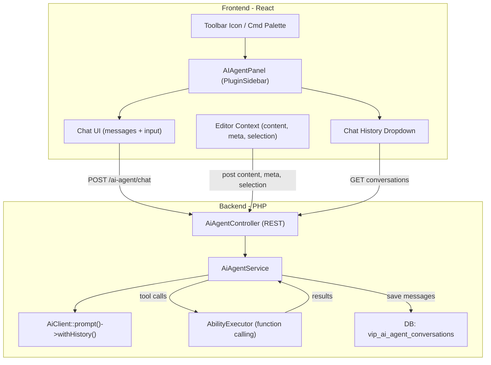

# AI Agent — Conversational Assistant for the Post Editor

> **Moved (2026-07-09):** the AI Agent has been extracted from core into the
> standalone **`vip-ai-agent`** plugin (a sibling repo, like `vip-bylines`). It
> depends on VIP Workflow and registers back through the abilities, prompts, and
> REST-controller extension points. Ability ID (`vip-workflow/ai-agent`), REST
> namespace (`vip-workflow/v1` + `ai-agent`), settings keys, and the
> `vip_ai_agent_conversations` table are unchanged. This spec describes the
> feature; the code now lives in the `vip-ai-agent` repo.

---

## 1. Overview

Add an AI Agent as a Workflow Ability — a conversational chat interface embedded in the post editor that understands post content, metadata, highlighted text, and available tools/abilities. Users interact via natural language to generate titles, create excerpts, rewrite sentences, and more.

The agent:

1. **Knows the post** — full content, title, excerpt, categories, tags, custom meta, workflow status
2. **Knows the tools** — registered abilities (Excerpt Generator, SEO Check, etc.) are available as callable functions
3. **Knows the selection** — if text is highlighted in the editor, the agent can act on it
4. **Persists conversations** — chat history is saved per-post, accessible via a history dropdown
5. **Applies changes** — can update the post title, excerpt, or replace selected text with user confirmation

**Display Name**: "AI Agent" is a working name. The display label is stored in a single PHP constant (`AI_AGENT_DISPLAY_NAME`) and passed to JS, making it trivial to rename based on marketing feedback. Internal function/variable names use `ai_agent`.

---

## 2. Architecture



### File Organization

The AI Agent spans three areas of the codebase, following existing conventions:

- **Ability registration** → `includes/abilities/tools/ai-agent.php` (thin file, ~50-80 lines, consistent with seo-check.php, readability.php, etc.)
- **AI service logic** → `includes/ai/class-ai-agent-service.php` (alongside `class-event-dispatcher.php`)
- **REST endpoints** → `includes/api/class-ai-agent-controller.php` (alongside all other controllers)
- **Frontend panel** → `src/editor/components/AIAgentPanel.js` + `src/editor/components/ai-agent/` sub-components

### Relationship to Existing Systems

| System | How AI Agent Uses It |
|--------|---------------------|
| Abilities API | Registers as an ability with `has_sidebar_panel: true`; queries registry for available tools |
| AbilityExecutor | Executes abilities when the AI decides to use a tool (e.g., excerpt generation) |
| AiClient | Multi-turn chat via `prompt()->withHistory()->usingSystemInstruction()` |
| ToolsPanel | Excludes AI Agent (it has its own sidebar panel) |
| Command Palette | Registers an "Open AI Agent" command |

---

## 3. Backend

### 3.1 Ability Registration — `includes/abilities/tools/ai-agent.php`

Registers as a Workflow ability with meta flags that give it its own sidebar panel:

```php
const AI_AGENT_DISPLAY_NAME = 'AI Agent';

wp_register_ability('vip-workflow/ai-agent', [
    'label'               => AI_AGENT_DISPLAY_NAME,
    'description'         => 'Conversational AI assistant with post context and tool awareness.',
    'category'            => 'vip-workflow',
    'execute_callback'    => null,  // Not executed like normal abilities — uses its own chat endpoint
    'permission_callback' => [ __NAMESPACE__ . '\\AiAgentPermissions', 'can_use' ],
    'meta'                => [
        'has_sidebar_panel' => true,
        'show_in_rest'      => true,
        'show_in_commands'  => true,
        'type'              => 'agent',
        'icon'              => 'format-chat',
    ],
]);
```

Included and called from `class-plugin.php` `register_abilities()` (around line 252), same as other tools.

### 3.2 REST Controller — `includes/api/class-ai-agent-controller.php`

Extends `WP_REST_Controller`, registered in `class-rest-controller.php` alongside all other controllers.

**Endpoints:**

| Method | Route | Purpose |
|--------|-------|---------|
| POST | `/ai-agent/chat` | Send a message, receive AI response |
| GET | `/ai-agent/conversations` | List all visible conversations for a post (`?post_id=X`) |
| GET | `/ai-agent/conversations/{id}` | Get full conversation with messages |
| DELETE | `/ai-agent/conversations/{id}` | Delete a conversation (owner only) |
| POST | `/ai-agent/conversations/{id}/private` | Toggle private flag (owner only) |
| POST | `/ai-agent/apply` | Apply a change to the post |

**Chat endpoint params:**

- `conversation_id` (int, optional) — existing conversation to continue; omit to start new
- `post_id` (int, required) — the post being edited
- `message` (string, required) — user's message
- `context` (object) — fresh post state sent with each message:
  - `content` — full post content (stripped HTML)
  - `title` — current title
  - `excerpt` — current excerpt
  - `meta` — relevant post meta (workflow status, categories, tags)
  - `selection` — highlighted text in the editor (if any)
  - `selection_block_id` — clientId of the block containing the selection

**Chat endpoint response:**

```json
{
  "conversation_id": 42,
  "message": {
    "role": "assistant",
    "content": "Here are 3 title options:\n\n1. ...\n2. ...\n3. ...",
    "actions": [
      { "type": "set_field", "field": "title", "value": "Option 1 text", "label": "Use Title 1" },
      { "type": "set_field", "field": "title", "value": "Option 2 text", "label": "Use Title 2" },
      { "type": "set_field", "field": "title", "value": "Option 3 text", "label": "Use Title 3" }
    ],
    "timestamp": "2026-02-12T10:30:00Z"
  }
}
```

**Apply endpoint params:**

- `post_id` (int, required)
- `field` (string, required) — `title`, `excerpt`, or `content`
- `value` (string, required) — the new value
- `selection_range` (object, optional) — for content replacements: `{ block_id, offset_start, offset_end }`

### 3.3 AI Agent Service — `includes/ai/class-ai-agent-service.php`

Core orchestration. Single class with clear responsibilities:

**`build_system_prompt(int $post_id): string`**

Constructs a context-rich system instruction including:
- Post content (stripped tags, truncated to ~8000 chars for token budget)
- Title, excerpt, status, author, categories, tags
- Workflow status and stage (if in a workflow)
- Custom post meta relevant to the post type
- Available abilities formatted as tool descriptions (name, description, what they do)
- Instructions for response format: when to suggest actions, how to format options

**`chat(int $conversation_id, string $message, array $context): array`**

Main chat flow:
1. Load conversation history from DB
2. Build `Message` objects from history using `MessageRoleEnum::user()` / `MessageRoleEnum::model()`
3. Build system prompt with fresh context from `$context`
4. Call `AiClient::prompt($message)->withHistory(...$history)->usingSystemInstruction($system)->usingModel(OpenAiProvider::model('gpt-4o'))->generateText()`
5. Parse response for structured action suggestions
6. Save user message + assistant response to conversation in DB
7. Return response with any action suggestions

**`get_available_tools(): array`**

Queries the ability registry for enabled abilities, formats them as descriptions the AI can understand. The AI doesn't call tools autonomously via function calling — instead, it recommends tools (e.g., "I can generate an excerpt for you") and returns a `run_ability` action. When the user confirms in chat, the frontend triggers the exact same ability run flow as the ToolsPanel — calling `POST /abilities/{id}/run` and opening the tool's native modal (`HelperResultModal`, `CheckResultsModal`). The user interacts with the tool's own UI as normal.

**Model configuration:**

The model is configurable in Workflow settings (stored in `vip_workflow_ability_settings` alongside other ability options). Default: `gpt-4o`.

### 3.4 Database — `vip_ai_agent_conversations`

New table in `class-schema.php` (bump `VERSION` to `2.6.0`):

```sql
CREATE TABLE {prefix}vip_ai_agent_conversations (
    id BIGINT UNSIGNED NOT NULL AUTO_INCREMENT,
    post_id BIGINT UNSIGNED DEFAULT NULL,
    user_id BIGINT UNSIGNED NOT NULL,
    title VARCHAR(255) DEFAULT '',
    messages LONGTEXT NOT NULL,
    context_type VARCHAR(50) DEFAULT 'post',
    is_private TINYINT(1) NOT NULL DEFAULT 0,
    created_at DATETIME NOT NULL DEFAULT CURRENT_TIMESTAMP,
    updated_at DATETIME NOT NULL DEFAULT CURRENT_TIMESTAMP ON UPDATE CURRENT_TIMESTAMP,
    PRIMARY KEY (id),
    KEY post_id (post_id),
    KEY user_id (user_id),
    KEY context_type (context_type)
);
```

- `post_id` is nullable — future admin-wide conversations won't have a post
- `context_type` defaults to `'post'` — future values: `'admin'`, `'package'`, etc.
- `is_private` — when `1`, conversation is only visible to its owner; default `0` (public to all editors on the post)
- `messages` stores JSON: `[{ role, content, timestamp, actions? }]`
- `title` auto-generated from the first user message (truncated)

### 3.5 Modified PHP Files

- `includes/class-plugin.php` — Include `ai-agent.php`, call `register_ai_agent()`, pass `aiAgentLabel` to `wp_localize_script`
- `includes/api/class-rest-controller.php` — Instantiate and register `AiAgentController`
- `includes/database/class-schema.php` — Add conversations table, bump version
- `includes/editor/class-editor-integration.php` — Pass `aiAgentLabel` and `aiAgentEnabled` to `window.vipWorkflowEditor`

---

## 4. Frontend

### 4.1 Panel Registration

The AI Agent gets its own `PluginSidebar` (separate from the existing Workflow sidebar) in `src/editor/index.js`:

- `name="vip-workflow-ai-agent"`
- `icon="format-chat"`
- Title from `window.vipWorkflowEditor.aiAgentLabel`
- Paired `PluginSidebarMoreMenuItem` for the "More tools" menu

This gives it its own icon in the top toolbar, next to the existing Workflow networking icon.

### 4.2 Chat UI — `src/editor/components/AIAgentPanel.js`

Full-height flex layout inside the sidebar:

```
AIAgentPanel
├── Header
│   ├── Hamburger icon (opens chat history dropdown)
│   └── "New Chat" button
├── MessageList (scrollable, flex-grow: 1)
│   └── ChatMessage[] (user right-aligned, assistant left-aligned)
│       └── ActionBar (inline confirm/reject buttons when AI suggests a change)
└── ChatInput (fixed at bottom)
    ├── Textarea (auto-resize, Enter to send, Shift+Enter for newline)
    └── Send button
```

**Sub-components in `src/editor/components/ai-agent/`:**

- `ChatMessage.js` — Message bubble. User messages right-aligned with blue-tinted background (`#e7f3ff`), assistant left-aligned with neutral background (`#f6f7f7`). Supports basic markdown rendering. Shows tool/action results inline.
- `ChatHistory.js` — Dropdown triggered by hamburger icon in header. Lists past conversations (title + relative date). Click to load. "New Chat" at top.
- `ChatInput.js` — Auto-resizing textarea with send button. Disabled while awaiting response. Shows a typing indicator (animated dots) in the message list while waiting.

### 4.3 Post Context & Selected Text

The frontend gathers fresh context before each message:

```js
// Post content and metadata from editor store
const title = select('core/editor').getEditedPostAttribute('title');
const content = select('core/editor').getEditedPostAttribute('content');
const excerpt = select('core/editor').getEditedPostAttribute('excerpt');

// Selected/highlighted text
const selectedBlock = select('core/block-editor').getSelectedBlock();
const selectionStart = select('core/block-editor').getSelectionStart();
const selectionEnd = select('core/block-editor').getSelectionEnd();
const selectedText = window.getSelection()?.toString() || '';
```

Context is sent with every chat message so the AI always has the latest post state.

**Selection handling details:**

- `getSelectionStart()` / `getSelectionEnd()` return `{ clientId, attributeKey, offset }` — we know exactly which block and character range
- `window.getSelection().toString()` gives us the actual highlighted string
- Both are sent to the backend so the AI can reference the selected text in its response
- v1 scopes selection replacement to single-block selections (paragraph, heading). Multi-block selection shows a message asking to narrow the selection.

### 4.4 Applying Changes

When the AI response includes `actions`, the chat renders inline action buttons below the message. On confirm:

**Title / Excerpt:**

```js
wp.data.dispatch('core/editor').editPost({ [field]: value });
```

Same pattern used by `ToolsPanel.js` and `HelperResultModal`.

**Replace selected text:**

```js
const block = select('core/block-editor').getBlock(selectionBlockId);
const currentContent = block.attributes.content;
// Replace the selected range within the block's content
const newContent = currentContent.slice(0, offsetStart) + newText + currentContent.slice(offsetEnd);
dispatch('core/block-editor').updateBlockAttributes(selectionBlockId, { content: newContent });
```

This works for paragraph and heading blocks where `content` is the main text attribute. For v1 this covers the primary use case of "rewrite this sentence."

**Run an ability (e.g., Excerpt Generator):**

When the AI response includes a `run_ability` action, the chat renders a button. On click, the frontend triggers the exact same flow as the ToolsPanel:

```js
const result = await apiFetch({
    path: `/vip-workflow/v1/abilities/${abilityId}/run`,
    method: 'POST',
    data: { post_id: postId },
});
// Open the tool's native modal (HelperResultModal or CheckResultsModal)
setModalTool(ability);
setModalResult(result);
```

The user interacts with the tool's own modal UI (Apply, Regenerate, Close) — consistent with the existing experience.

### 4.5 Command Palette

Register an "Open AI Agent" command in `CommandPalette.js`:

```js
dispatch('core/commands').registerCommand({
    name: 'vip-workflow/open-ai-agent',
    label: window.vipWorkflowEditor.aiAgentLabel,
    icon: formatChat,
    callback: () => {
        dispatch('core/edit-post').openGeneralSidebar('vip-workflow/vip-workflow-ai-agent');
    },
});
```

### 4.6 Styles

Added to `src/editor/style.css`:

- Message bubbles with subtle backgrounds and rounded corners
- Smooth auto-scroll to bottom on new messages
- Fixed input area at bottom with border-top separator
- Hamburger menu as a Popover dropdown
- Typing indicator (animated dots) while waiting for AI response
- Action buttons styled as subtle pill buttons within assistant messages
- Clean, modern aesthetic consistent with the existing Workflow panel styles

---

## 5. Example Interactions

### Generate a Title

> **User**: "Create a title for this post"
>
> **AI**: "Based on the content about remote work productivity, here are 3 options:
> 1. 'The Remote Work Paradox: Why Flexibility Demands More Discipline'
> 2. '5 Habits That Separate Productive Remote Workers From the Rest'
> 3. 'Remote Work Isn't Broken — Your Routine Is'"
>
> [Use Title 1] [Use Title 2] [Use Title 3]

User clicks "Use Title 2" → title field updates immediately.

### Generate an Excerpt

> **User**: "Create an excerpt for this post"
>
> **AI**: "I can use the Excerpt Generator to create one based on your post content. Want me to run it?"
>
> [Run Excerpt Generator]
>
> *(User clicks → the standard Excerpt Generator modal opens with the generated excerpt, "Use This" / "Regenerate" buttons — same experience as running it from the ToolsPanel)*

### Rewrite Highlighted Text

> *(User highlights "This is really good and cool" in the post)*
>
> **User**: "Rewrite this in a more formal tone"
>
> **AI**: "Here's a more formal version:
> 'This represents a significant and noteworthy achievement'
>
> Should I replace the selected text?"
>
> [Replace Selection] [Try Again]

---

## 6. Future-Proofing

The architecture is designed to work beyond the post editor:

- `context_type` column in DB (`'post'` vs `'admin'`) allows non-post conversations
- `post_id` is nullable for admin-wide chats
- `AiAgentService` accepts a generic context object, not just post IDs
- REST routes are not scoped under `/posts/` so they work without a post context
- The frontend panel component can accept a `contextType` prop (defaults to `'post'`)
- For non-post contexts, a different panel layout can be rendered based on `contextType` (no editor integration, just general Workflow questions)

---

## 7. File Summary

**New files (7):**

| File | Purpose |
|------|---------|
| `includes/abilities/tools/ai-agent.php` | Ability registration, display name constant |
| `includes/ai/class-ai-agent-service.php` | System prompt, chat orchestration, tool awareness |
| `includes/api/class-ai-agent-controller.php` | REST endpoints for chat and conversations |
| `src/editor/components/AIAgentPanel.js` | Main panel component |
| `src/editor/components/ai-agent/ChatMessage.js` | Message bubble component |
| `src/editor/components/ai-agent/ChatHistory.js` | Past conversations dropdown |
| `src/editor/components/ai-agent/ChatInput.js` | Input textarea component |

**Modified files (6):**

| File | Change |
|------|--------|
| `includes/class-plugin.php` | Include ai-agent.php, register ability, pass label to JS |
| `includes/api/class-rest-controller.php` | Register AiAgentController |
| `includes/database/class-schema.php` | Add conversations table, bump to 2.5.0 |
| `includes/editor/class-editor-integration.php` | Pass `aiAgentLabel` and `aiAgentEnabled` to JS |
| `src/editor/index.js` | Add PluginSidebar + PluginSidebarMoreMenuItem |
| `src/editor/style.css` | Chat UI styles |
